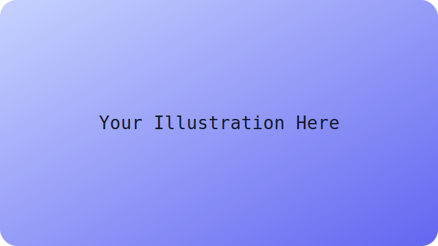

# Personal Website Content Guide

This site is a small single-page app (SPA) that reads all of its copy from plain JavaScript files. Each
section has its own data file so you can edit content without touching the rendering logic.

## Project Layout

```
├── index.html                  # Shell page that loads everything
├── app.js                      # Router + renderer
├── data.js                     # Glues together data from the content folder
├── style.css                   # Styles (including post + button rules)
├── content/
│   ├── home.js                 # Intro paragraphs for the home view
│   ├── experience.js           # Timeline items for Experience
│   ├── projects.js             # Project cards + links
│   ├── education.js            # Education timeline
│   └── posts.js                # Metadata for blog posts
└── posts/
    ├── images/                 # SVG/PNG assets referenced by posts
    ├── post-template.html      # Boilerplate for new posts
    └── *.html                  # One file per post (article markup only)
```

`index.html` loads every `content/*.js` file, then `data.js` converts those globals into `SITE_DATA`,
`POSTS`, and `HOME_CONTENT` objects that `app.js` uses when rendering.

## Running Locally

Open `index.html` straight in a browser for a quick preview. For a closer-to-prod setup, start any static
server inside the project directory (examples: `python3 -m http.server 4173`, `npx serve .`). When using the
Docker image, rebuild with `docker compose up --build` so the updated `content/` and `posts/` folders are
copied into Nginx.

## Editing The Home Section

1. Open `content/home.js`.
2. Update the `intro` array with one or more strings. Each string renders as a `<p>` in the hero area.
3. Save and refresh – no other wiring is required.

Example:
```js
window.HOME_CONTENT = {
  intro: [
    "Hello, you just came to my personal website. My name is Indraswara, you can call me Indra.",
    "I enjoy building lightweight tools and writing about the process.",
  ],
}
```

## Updating Experience / Education

- Experience items live in `content/experience.js` as `window.EXPERIENCE_ITEMS`.
- Education items live in `content/education.js` as `window.EDUCATION_ITEMS`.

Each item supports `title`, `date`, `description`, and `tags`:
```js
{
  title: "Senior Developer",
  date: "2022 - Present",
  description: "Building scalable web applications and leading development teams.",
  tags: ["JavaScript", "React", "Node.js"],
}
```
Add/remove objects to taste and reload the page.

## Managing Projects

Projects live in `content/projects.js` under `window.PROJECT_ITEMS`. Each entry can expose a `link`, which
turns on a “View Project” button under that card.

```js
{
  title: "Personal Website",
  date: "2024",
  description: "A simple, plain text personal website with easy content management.",
  tags: ["HTML", "CSS", "JavaScript", "Docker"],
  link: "https://github.com/indraswara/personal-website",
}
```
Leave `link` undefined to hide the button.

## Adding Or Editing Posts

1. **Create the article file**
   - Duplicate `posts/post-template.html` and rename it to `posts/<slug>.html`.
   - Keep only the `<article>…</article>` block; everything inside becomes the rendered post body.
   - Use standard HTML plus optional figures:
     ```html
     <figure class="post-figure">
       
       <figcaption>Your caption here.</figcaption>
     </figure>
     ```

2. **Add the metadata**
   - Open `content/posts.js` and append a new object to `window.POST_ENTRIES`:
     ```js
     {
       slug: "my-new-post",
       title: "My New Post",
       date: "2024-03-10",
       description: "Short teaser shown in the post list.",
       tags: ["JavaScript", "Tips"],
       contentPath: "posts/my-new-post.html",
     }
     ```
   - The `slug` becomes the route (`#/post/my-new-post`), so keep it lowercase with dashes.

3. **Add images (optional)**
   - Drop SVG/PNG assets into `posts/images/` and reference them with `src="posts/images/<file>.svg"`.

4. **Verify**
   - Reload the site, go to `#/post`, and click “Read Post” to confirm the article loads and any images
     render.

## Deploying

1. Commit your changes.
2. Rebuild/redeploy your Docker image so `content/` + `posts/` are copied (Dockerfile already handles this).
3. Smoke-test:
   - `#/` pulls the new home copy.
   - `#/experience`, `#/education`, `#/project` show updated entries.
   - `#/post` lists new posts and detail views fetch the corresponding HTML.

## Troubleshooting

- **Seeing the home page inside a post?** Ensure `nginx.conf` (or your static host) serves `/posts/` files
  directly instead of falling back to `index.html`.
- **New copy not showing?** Hard-refresh (`Ctrl+Shift+R`) to bypass cached JS files.
- **Images missing?** Confirm the file exists in `posts/images/` and was deployed to the server.

Happy publishing!
